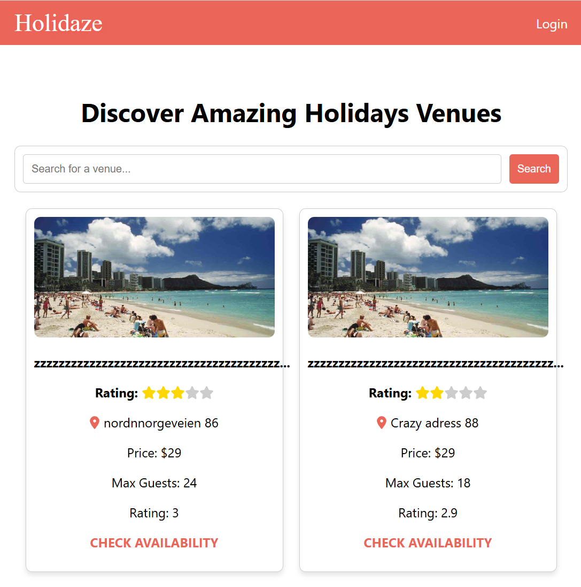

# 🌍 Holidaze - Accommodation Booking Platform



Holidaze is a modern, responsive accommodation booking web application developed as part of my final exam project in frontend development. This application serves both a **customer-facing side**—allowing users to browse and book holiday venues—and an **admin-facing side**—enabling venue managers to register, manage venues, and handle bookings.

---

## 📜 Table of Contents
- [Project Overview](#project-overview)
- [Project Goals](#project-goals)
- [Features & User Stories](#features--user-stories)
- [Technical Requirements & Restrictions](#technical-requirements--restrictions)
- [Configured With](#configured-with)
- [API Documentation](#api-documentation)
- [Design & Planning Resources](#design--planning-resources)
- [Setup & Installation](#setup--installation)
- [Acknowledgements](#acknowledgements)
- [Contact](#contact)

---

## 📖 Project Overview
Holidaze is an accommodation booking platform created for a newly launched service. The project involves building a **frontend application** based on an existing API, as documented in the **Noroff API Documentation**.

### 🔹 **Application Sections:**
- **Customer Side:** Users can view a list of venues, search for a specific venue, check availability, and make bookings.
- **Admin Side:** Users with a **stud.noroff.no email** can register as **venue managers**, create/update/delete venues, and manage bookings.

This project demonstrates my ability to design and develop a **full-featured frontend application** using modern web development practices.

---

## 🎯 Project Goals
- **Demonstrate Development Capabilities:** Showcase comprehensive frontend development skills acquired over the last two years.
- **User Experience & Design:** Deliver an intuitive and responsive UI that enhances user engagement.
- **API Integration:** Seamlessly integrate with an existing API to manage all booking functionalities.
- **Technical Proficiency:** Utilize approved technologies and tools as specified in the project brief.

---

## ✨ Features & User Stories
### 🏠 **Venue Browsing & Searching**
- A user may view a list of venues.
- A user may search for a specific venue.
- A user may view a specific venue page by ID.
- A user may view a calendar with available dates for a venue.

### 🛒 **Customer Functionality**
- A user with a **stud.noroff.no** email may register as a customer.
- A registered customer may **create a booking** at a venue.
- A registered customer may **view their upcoming bookings**.

### 🏨 **Venue Manager Functionality**
- A user with a **stud.noroff.no** email may register as a venue manager.
- A registered venue manager may **create a venue**.
- A registered venue manager may **update a venue they manage**.
- A registered venue manager may **delete a venue they manage**.
- A registered venue manager may **view bookings for a venue they manage**.

### 🔑 **User Account Management**
- A registered user may **log in**.
- A registered user may **update their avatar**.
- A registered user may **log out**.

---

## 🔧 Technical Requirements & Restrictions
- **JavaScript Framework:** Must use an approved framework (e.g., React v16+).  
  ✅ **The project uses React v19**
- **CSS Framework:** Must use an approved framework (e.g., Bootstrap v5+, Tailwind v3+, MUI v5+, Styled Components, or CSS Modules).  
  
  ✅ **Hosted on Netlify**
- **Design & Planning Tools:** Planning done with **GitHub Projects**, design created with **Figma**.

---

## ⚙️ Configured With
- 
- **Prettier** (Code formatting)
- **ESLint** (Linting and best practices)
 - **Styled Components (for styling enhancements)
- **Lint-Staged & Husky** (Git hooks for better code quality)

---

## 📡 API Documentation
All backend functionality is managed through the **Noroff API**.  
🔗 **API Documentation:** [Noroff API Docs](#)  
🔗 **API Swagger:** [View API Reference](#)

---

## 🎨 Design & Planning Resources
- **Design Prototype:** [View Prototype](#)
- **Style Guide:** [View Style Guide](#)
- **Gantt Chart:** [View Gantt Chart](#)
- **Kanban Board:** [View Kanban Board](#)

---

## 🏗 Setup & Installation
### 🔹 **Clone the Repository**
```sh
  git clone https://github.com/yourusername/holidaze.git
  cd holidaze
```
### 🔹 **Install Dependencies**
```sh
  npm install
```
### 🔹 **Configure Environment Variables**
Create a `.env` file in the root directory and add any required environment variables as specified in the documentation:
```sh
VITE_API_KEY=<YOUR_API_KEY>
VITE_API_URL=<YOUR_API_BASE_URL>
```
### 🔹 **Run the Application**
```sh
  npm run dev
```
The application should now be running on **http://localhost:5173**.

### 🔹 **Build for Production**
```sh
  npm run build
```

---

## 🙌 Acknowledgements
Thank you to everyone who supported me throughout this project, including my mentors, peers, and the Noroff team.This project was developed as part of my frontend development studies. It represents my ability to build a complete, functional web application from scratch.

---

## 📬 Contact
[](#)  
For any questions or feedback, feel free to reach out! 🚀

